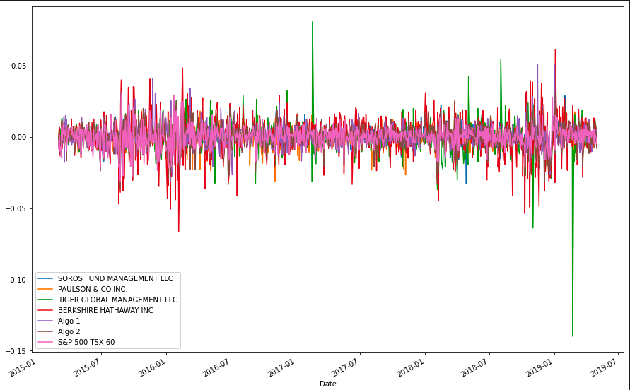
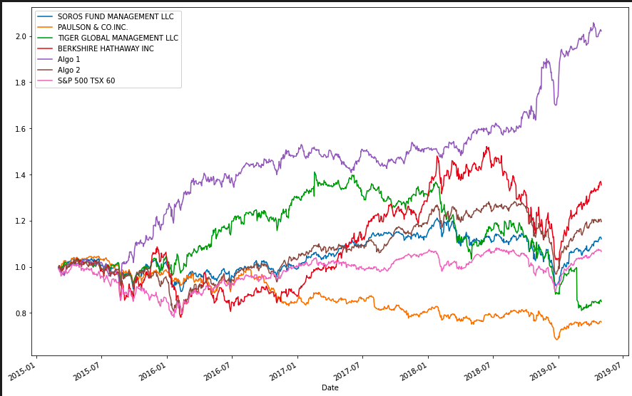
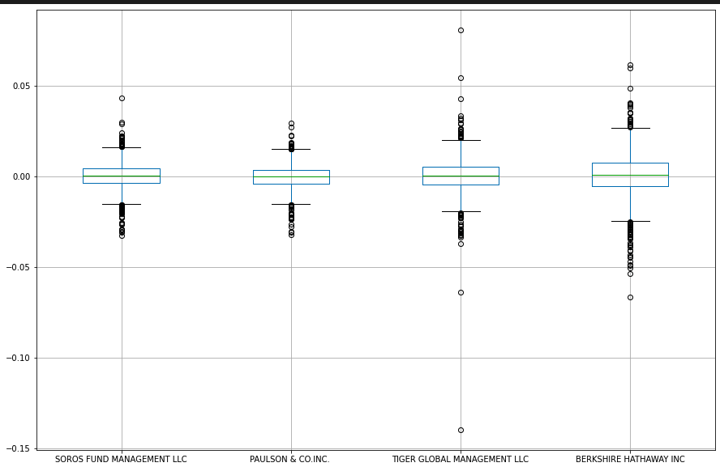
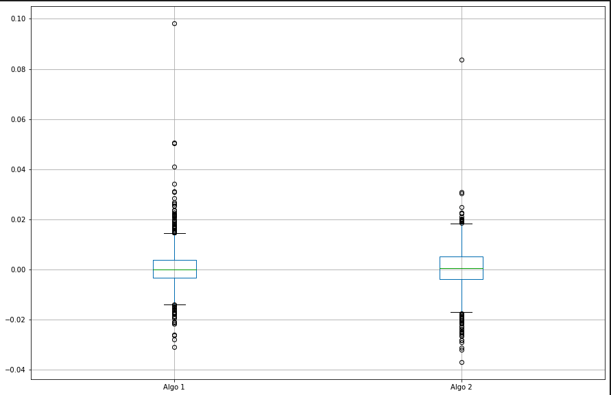
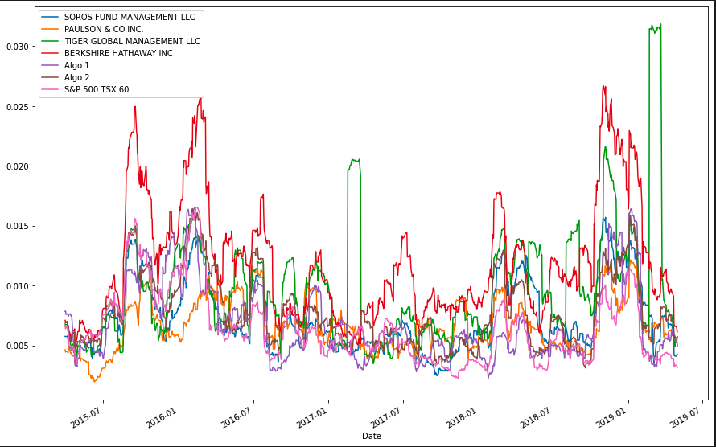
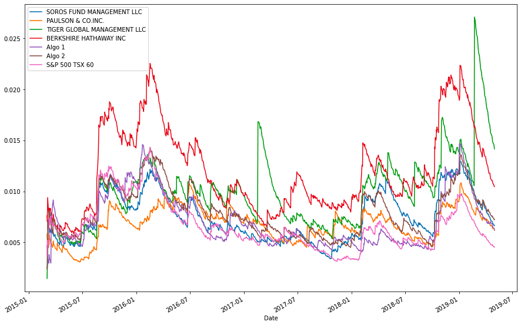
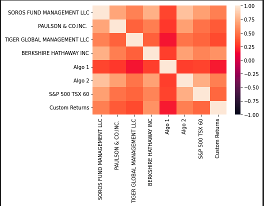
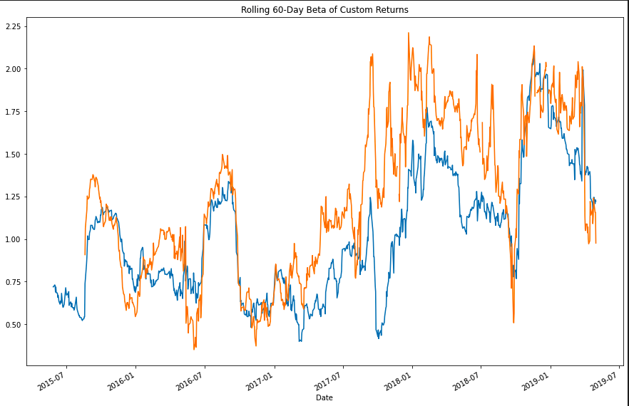
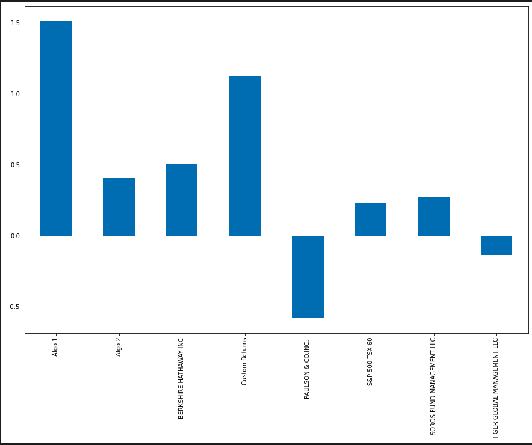

# Portfolio Analysis

## Description
This is a quantitative portfolio analysis of mutual, hedge fund, algorithmic and custom portfolios to assess overall performance. Performance is measured to derrmine the best across multiple areas including volatility, returns, risk and Sharpe ratios.

The portfolios included in this analysis are Berkshire Hathaway Inc, Soros Fund Management LLC, Paulson & CO. Inc., Tiger Global Management LLC and 2 algorithmics named 'Algo 1' and 'Algo 2'. A custom portfolio consisting of SHOP, TSLA and AAPL were selected. The S&P TSX 60 Index is our benchmark for the overall market.

## Libraries
This project requires the pandas, numpy, datetime and matplotlib libraries.

## Data Sources
All portfolio data was provided by the University of Toronto's School of Continuing Studies Fintech bootcamp. Custom portfolio ticker data was obtained via [Google Sheets](https://docs.google.com/spreadsheets/).

# Analysis Charts

## Daily Returns

## Cumulative Returns

## Standard Deviation Boxplots

## Combined 21-Day Rolling Standard Deviation

## Exponentially Weighted Moving Average

## Correlation Matrix

## Custom Portfolio Rolling 60-Day Beta

## Sharpe Ratios

# Summary Analysis

## a) Determine whether the algorithmic strategies outperform both the market (S&P TSX 60) and the mutual and hedge fund portfolios.

In order to asses the algorithmic portfolios' performance compared to the mutual and hedge funds' portfolios, let's break down the evaluated metrics:

1. <strong>21-day & Annualized Standard Deviation (SD) </strong> - 
    Algo 1 falls in the middle of the pack with a 21-day SD of 0.8% and annualized SD of 12%. Algo 2 also falls in the middle of the pack with 0.8% and 13%, respectively. Both are not the most volatile nor the least in these measures.
    
2. <strong>Correlation</strong> - 
    Algo 1 is the least positively correlated compared to every other portfolio and the S&P TSX 60. Algo 2 is postively correlated with the Soros Management Fund and the S&P TSX 60 at 83% and 73%, respectively. It is the least positively correlated with Algo 1 at 28.5%.
    
4. <strong>Boxplot</strong> - 
    Algo 1's box plot displays the most positive amd highest cumulative returns compared to all other portfolios. Algo 2's boxplot displays a large number cumulative losses.

5. <strong>Sharpe Ratio</strong> -
    Algo 1's Sharpe ratio sits at 1.49. The runner-up is Berkshire Hathaway at 0.47. While Algo 2 sits in 3rd place of the group at 0.39.
    
6. <strong>Exponentially Weighted Moving Average (EWM) with 21day Half-Life</strong> -
    However in this metric, both Algo 1 has a greater drawdown than Algo 2, but the overall top performers are Berkshire Hathaway and Tiger Global.
    
Overall, Algo 1 outperforms all portfolios by a significant margin in this performance analysis. While Algo 2 falls behind Berkshire Hathaway for 2nd best performing. The only caveat is the EWM metric where Algo 1 experiences a major drawdown and slips behind Berkshire Hathaway and Tiger Global who become the top performers.

## b) How does the custom portfolio perform?

The breakdown of the metrics are as follows:

1. <strong>21-day Standard Deviation</strong> - 
    The custom portfolio presents a highly volatile STD with the highest of the group at 29%.
    
2. <strong>Correlation</strong> - 
    My portfolio is the least postively correlated with Algo 1 at 17%. It is most positively correlated to Berkshire Hathaway at 62%. While it's correlation with all other portfolios sit within the range of 32-54%.
    
3. <strong>60-Day Beta</strong> - 
    My portfolio is more volatile than the S&P TSX 60 given that it has has a 60-day beta mean of 1.24 with a min at 0.35 and a max at 2.21.

4. <strong>Sharpe Ratio</strong> - 
    My portfolio is only one of two portfolios to score above 1. It trails behind Algo 1's score of 1.5.
    
Overall, the custom portfolio performs well compared to the other portfolios. It is a suitable portfolio for someone who has a high risk tolerance due to its level of volatility given it's 21-day standard deviation and 60-day Beta metrics. However, it's Sharpe ratio indicates there is good excess reward to its risk.

